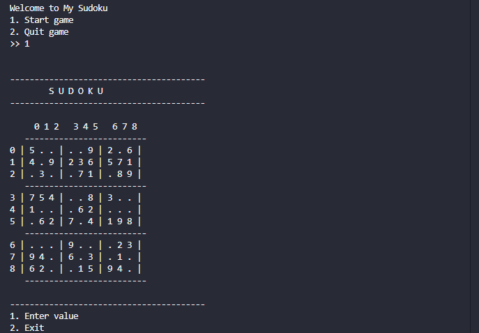

# Console Sudoku Game (C++)

A fully interactive, console-based Sudoku game developed in C++ using
object-oriented programming principles and a backtracking algorithm
to generate valid Sudoku boards.

The project focuses on clean software design, modular architecture,
robust input validation, and real-world development practices
commonly expected in Software Development Engineer (SDE) roles.

## 🚀 Features

- Generates a valid 9×9 Sudoku board using a recursive backtracking algorithm
- Creates a playable puzzle by removing selected values from the solved board
- Interactive console-based gameplay
- Clear grid rendering with row and column indices for easy navigation
- Real-time validation of user input against the solved Sudoku
- Prevents invalid moves and handles incorrect input gracefully
- Robust input handling to avoid infinite loops or crashes
- Modular design separating Sudoku generation and gameplay logic
- Build automation using Makefile

## 🖥️ Sample Console Output

## 🏗️ Project Architecture

The project is designed using a modular, object-oriented architecture
to separate responsibilities and improve maintainability.

The overall design follows a clear separation of concerns:

- **SudokuGenerator** handles all logic related to Sudoku creation
- **SudokuGame** manages gameplay, user interaction, and validation
- **main.cpp** acts as the entry point and controls application flow

### Components Overview

#### 1. SudokuGenerator
Responsible for generating and preparing the Sudoku puzzle.

Key responsibilities:
- Generate a complete valid 9×9 Sudoku board using backtracking
- Ensure Sudoku constraints (row, column, sub-grid)
- Create a playable puzzle by removing selected values
- Provide access to both the solved board and the puzzle board

#### 2. SudokuGame
Responsible for managing gameplay and user interaction.

Key responsibilities:
- Display the Sudoku grid in a user-friendly console format
- Accept and validate user input
- Prevent invalid or out-of-bound moves
- Compare user input against the solved board
- Detect puzzle completion and handle game exit

#### 3. main.cpp
Responsible for application startup and flow control.

Key responsibilities:
- Display initial menu
- Start or exit the game based on user choice

### 📊 High-Level Data Flow Diagram

The diagram below illustrates the high-level data flow between the user,
game logic, and puzzle generation components.

---

### 👨‍💻 Author

**Akash Wadode**  
MCA Student | C++ | Data Structures & Algorithms  

GitHub: https://github.com/akashwadode  
LinkedIn: www.linkedin.com/in/akash-wadode

---

⭐ If you found this project helpful, feel free to star the repository!
